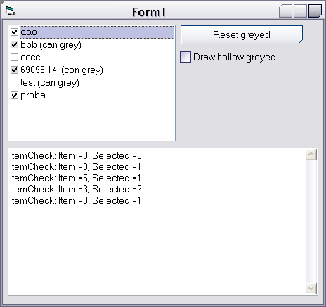

## ListBox extension \(grey checks\)

### Description

UPDATE(2003-12-06): Off-by-one error when using large font sizes fixed.

----

This is a class that extends standard VB.ListBox control when its style is set to 1 - Checkbox. In addition to the standard checked/unchecked states listbox items can be marked as unknown (greyed) too. Also, mouse clicks/dbl-clicks anywhere on the item are interpreted as selection requests. This behaviour closely emulates the listbox control implementation in the Outlook Categories dialog. Enjoy!
 
### More Info
 

             |
---                |---
**Submitted On**   |2003-12-05 18:50:38
**By**             |[Vlad Vissoultchev](https://github.com/Planet-Source-Code/PSCIndex/blob/master/ByAuthor/vlad-vissoultchev.md)
**Level**          |Intermediate
**User Rating**    |4.8 (29 globes from 6 users)
**Compatibility**  |VB 6\.0
**Category**       |[Custom Controls/ Forms/  Menus](https://github.com/Planet-Source-Code/PSCIndex/blob/master/ByCategory/custom-controls-forms-menus__1-4.md)
**World**          |[Visual Basic](https://github.com/Planet-Source-Code/PSCIndex/blob/master/ByWorld/visual-basic.md)
**Archive File**   |[ListBox\_ex1681091262003\.zip](https://github.com/Planet-Source-Code/vlad-vissoultchev-listbox-extension-grey-checks__1-50338/archive/master.zip)

